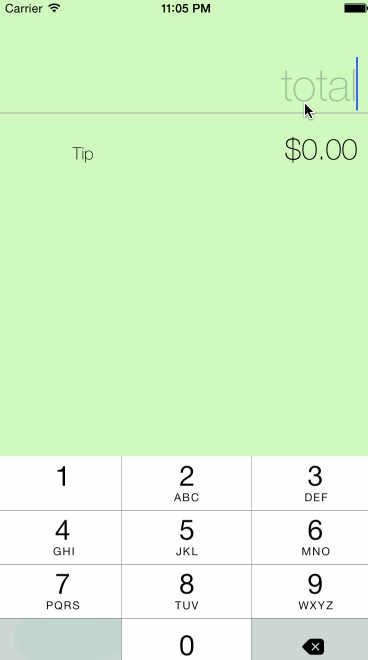

# Tip Calculator by Court Kizer

Quickly and easy calculate the tip on any bill. This demo application has added style and autolayout constrants.

Time spent: 2 hours spent in total

Completed user stories:

 * [x] Required: Enter bill amount
 * [x] Required: Select from a range of tip percentages
 * [x] Extra: Added autolayout constraints so it works in landscape mode on iPhone 6+

Notes:

Spent some time making the UI work across different iPhone models by using AutoLayout.

Walkthrough of all user stories:

GIF created with [LiceCap](http://www.cockos.com/licecap/).
